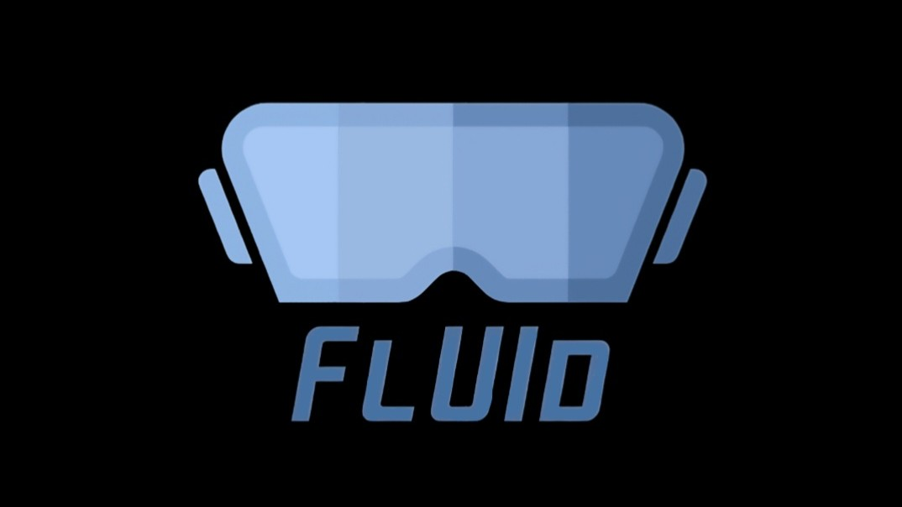

# FlUId: VR UI Design
FlUId is a VR application created to demonstrate good and bad user interface (UI) design practices in virtual reality. 
The project is based on design [Guidelines and Best Practices](../../wiki) and aims to provide an interactive, immersive way to experience the impact of UI design.

## Motivation
Designing effective user interfaces for VR is challenging due to the unique characteristics and opportunities of immersive environments. 
Many UI design principles taken from traditional desktop interfaces cannot be directly applied to VR as it introduces new factors that affect usability, comfort, accessibility, and immersion. 
FlUId was designed to provide a clear, side-by-side comparison of well-designed and poorly designed UI interfaces in VR and to help designers understand and apply VR-specific guidelines.

## Features
- Side-by-side comparison of good and bad UI implementations. Users can switch between the good and bad UI panels. Each panel demonstrates different approaches to layout, feedback, and interaction.
- A tutoral panel showcasing the good design principles, applied in the good UI design.
    
Watch the demo video:

## How to Run the Project in Unity

This project was developed using **Unity 2022.3.62f1** and is designed for the **Meta Quest 3S** headset with **Meta Quest Touch Plus controllers**.

### Steps to Run:

1. **Clone or Download the Project**
   - Clone the project with  `https://github.com/TUM-HN/VR-UI-Guidelines.git` or download it as a ZIP file.
   - Open the folder containing the Unity project in Unity Hub.

3. **Open the Scene**
   - In Unity, go to the **Project** window.
   - Navigate to: `Assets/Scenes/FlUID`.
   - Drag the `FlUID` scene into the **Hierarchy** window.

4. **Switch Platform to Android**
   - Go to **File > Build Settings**.
   - Select **Android** and click the **Switch Platform** button.

5. **Connect Your Headset**
   - Connect your **Meta Quest 3S** via USB cable.
   - Ensure the headset is **powered on** and **Developer Mode** is enabled.

6. **Detect the Headset**
   - In Build Settings, find the **Run Device** dropdown.
   - Click **Refresh** - your headset should now appear in the list.

7. **Build and Run**
   - Click the **Build and Run** button.
   - When prompted, select the `FlUID.apk` location.
   - Unity will build the app and automatically deploy it to your headset.
   - Press the flat Meta button on your right controller to center the menu in your view and you're ready to get started.
